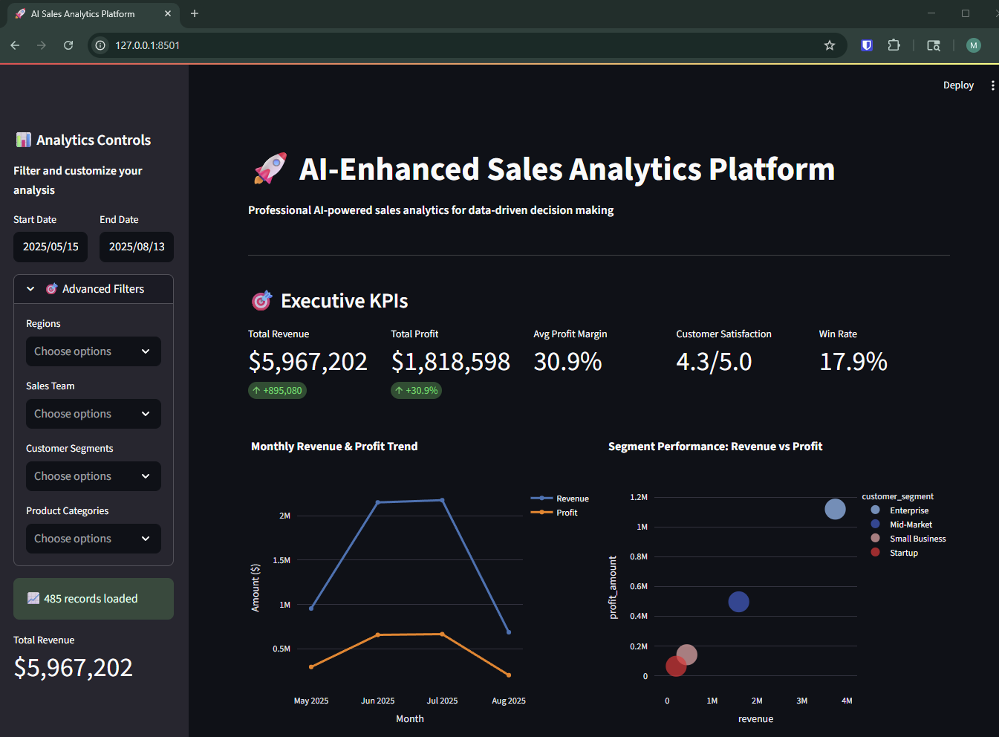
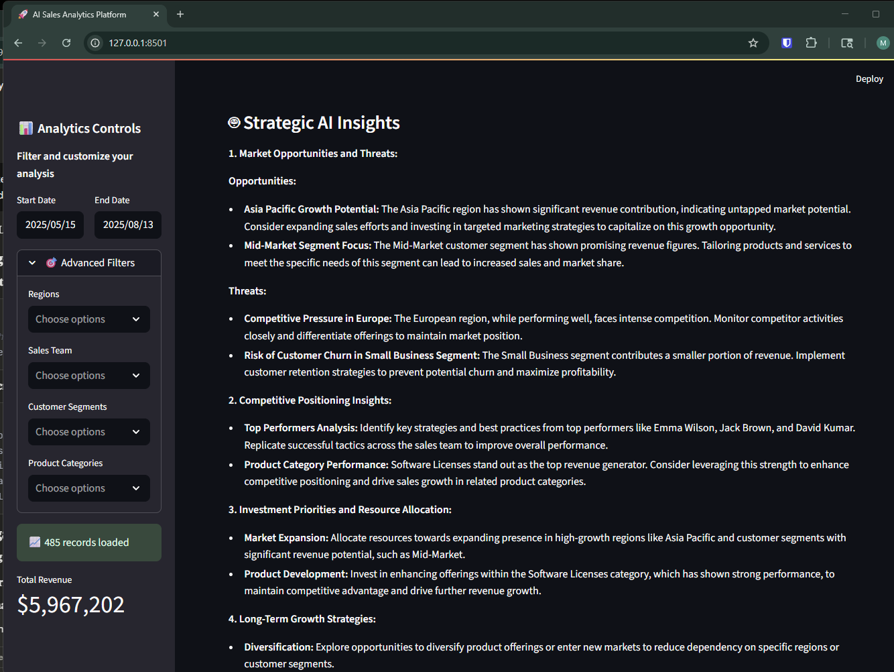
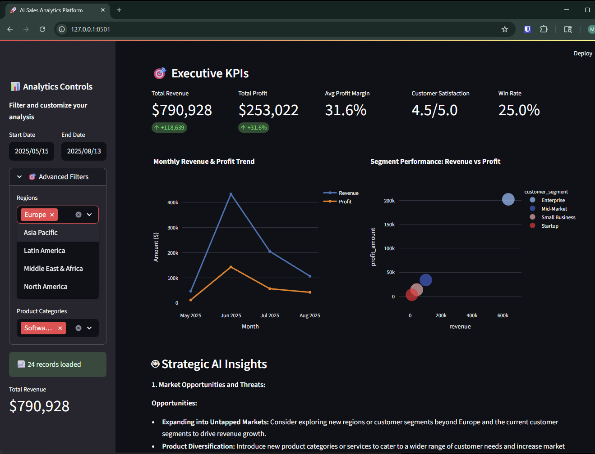
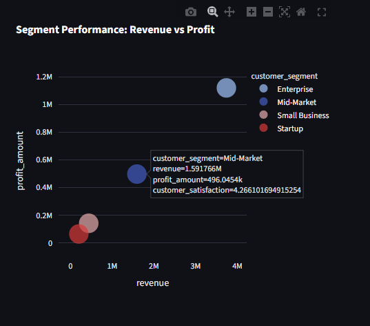

# AI Sales Analytics Platform

## Project Overview
**Problem**: Sales teams typically spend 4+ hours weekly creating static reports and struggle to extract actionable insights from their data. Traditional reporting tools lack the intelligence to identify patterns, anomalies, and strategic opportunities hidden in sales data.

**Solution**: An AI-enhanced sales analytics platform that transforms raw sales data into intelligent business insights. The platform combines traditional data visualization with OpenAI's GPT models to provide natural language analysis, trend identification, and strategic recommendations that would normally require a team of data analysts.

## Live Demo
- **Streamlit App**: [\[Live URL\]]
- **Docker Container**: `docker run -p 8501:8501 ai-sales-analytics`

## Screenshots

## Technical Implementation
- Frontend: Streamlit
- Visualization: Plotly
- Backend: Python/SQLite
- AI Services: OpenAI API
- Deployment: Docker

## Business Impact
- 75% reduction in report generation time
- Real-time insights for decision making
- Interactive exploration of data

## Deployment Notes
- Keep `requirements.txt` in this folder and at the repository root in sync.
- Dependencies are specified with version ranges to ensure Streamlit Cloud can
  resolve compatible packages. If deployment fails with a non-zero exit code,
  verify that the root `requirements.txt` matches this file and reinstall
  packages using `pip install -r requirements.txt`.

